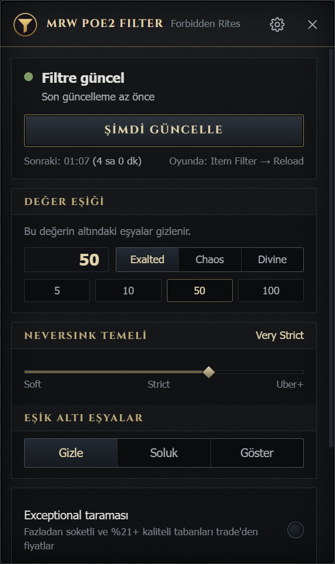
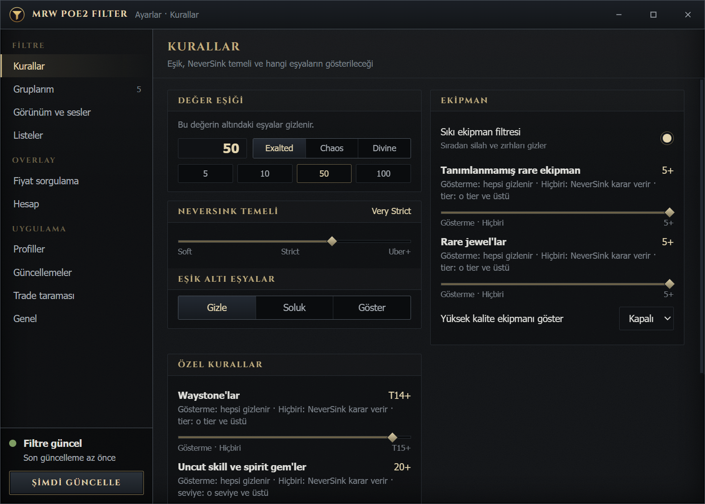
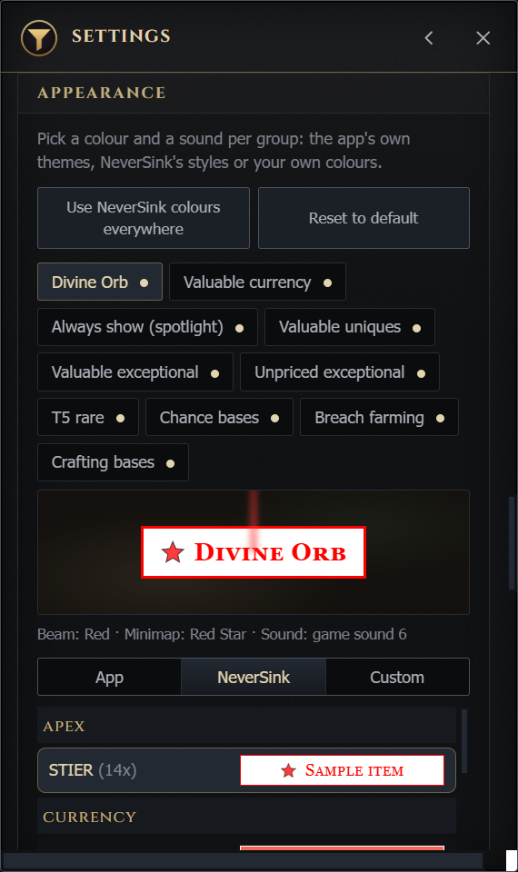
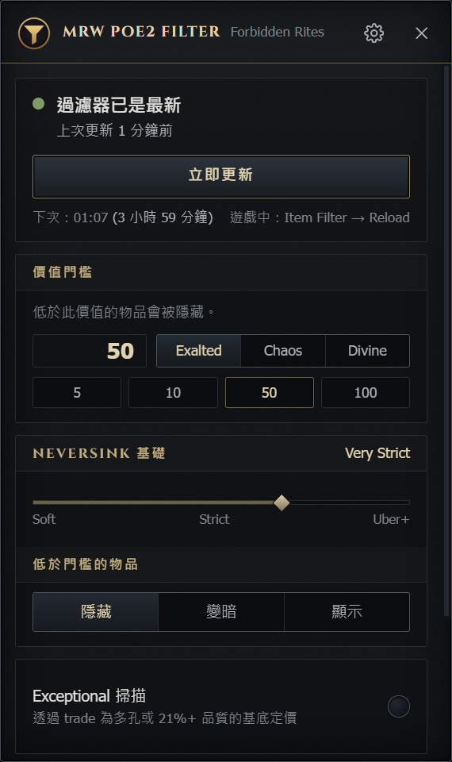

<p align="center"></p>

# MrW Overlay for POE 2

A system tray app that keeps NeverSink's Path of Exile 2 loot filter up to date with **live market prices** (Wails v3 + Svelte).

<p align="center">
  
  
</p>

You set a value threshold, say 50 exalted. The app checks the market regularly, makes everything above the threshold stand out on the ground, and hides or dims what falls below it. As prices move, the filter updates itself; you don't have to fix your lists by hand as the league goes on.

Where the prices come from:

- **Uniques** (poe.ninja): a base is shown if the most valuable unique on it is above the threshold; a price backed by a single listing is never a reason to hide anything.
- **Currency and stackable items** (poe2scout): whatever is below the threshold is hidden or dimmed.
- **Exceptional bases** (official trade API): bases with extra sockets or 21%+ quality are priced in the background, using a small share of the trade quota. *Later this scan will run on a single server; the app will get the prices ready-made and nobody will spend their own quota.*
- **NeverSink** (MIT): the strictness you pick is downloaded from GitHub on every update, and the rules are added before its first section. All of NeverSink's work is kept; your price rules sit on top of it.

The app does not read game memory and does not send input to the game; it only uses public price sources and writes the result to a text file.

**Languages:** English, Turkish and Traditional Chinese (繁體中文). The app follows the Windows language; you can change it under Settings → General → Language. Item and currency names stay in English in every language, because the filter recognises items by their English names.

## Download and install

Two ways, same app:

- **Microsoft Store:** [MrW Overlay for POE 2](https://apps.microsoft.com/detail/9PM376D3LFBG). Installs like any Store app, the Store keeps it updated, no SmartScreen warning.
- **GitHub:** download `poe2filtre-windows-amd64.exe` from the [Releases](../../releases/latest) page. No installer, a single file. Because the exe is unsigned, Windows SmartScreen may show "Windows protected your PC": **More info → Run anyway**. The file's SHA-256 is in the release notes if you want to compare.

Then:

1. The app sits in the system tray; click the icon for the panel, right-click for the menu.
2. In the game, pick **auto_updated** under **Options → Item Filter**.

Requirements: Windows 10/11 and WebView2 (preinstalled on Windows 11). Settings and data live under `%APPDATA%\PoE2Filtre`; both versions use this folder, so switching between them keeps your settings. Only one can run at a time.

## What happens on first run

- The app downloads the NeverSink filter and current prices and writes the filter within a few seconds: `Documents\My Games\Path of Exile 2\auto_updated.filter` (the file name can be changed in the settings). If your Documents folder was moved to OneDrive (`OneDrive\Documents`), the app finds it on its own.
- **The game does not reload the filter by itself.** After each update, use Options → Item Filter → **Reload** in the game.
- The exceptional base scan runs slowly in the background: to stay well within the trade API's quota it takes hours, and it builds up as long as the app is open. The panel shows the estimated time for the first full scan. Seeing incomplete results on the first day is normal; exceptional bases without a known price are shown, not hidden.
- Later updates happen automatically every 4 hours by default.
- **Roadmap:** the exceptional scan will later move to a single server and prices will be distributed from there. That will remove both the first-day wait and the shared trade quota; for now the scan runs on each user's own machine (you can share the results as a file under Settings → Trade scan).

## Settings

Clicking the tray icon opens a small panel: status, **Update now**, the value threshold and the NeverSink level. Everything else is in a separate window opened with the ⚙ button on the panel (or **Settings** in the tray menu), with sections on the left and the page on the right. This window does not disappear when you click into the game, so it can stay open next to it: change a colour and try it right away with Reload in the game.

| Section | What it does |
|---|---|
| **Value threshold** | The threshold and its unit (exalted / chaos / divine). Items below it are hidden or dimmed. |
| **NeverSink base** | Strictness (0 Soft … 6 Uber Plus Strict) or your own base filter file. |
| **Equipment** | Strict equipment filter, tier sliders for unidentified rare equipment and rare jewels, high quality threshold. |
| **Special rules** | Waystone, uncut gem and uncut support gem thresholds (sliders, including the "Don't show" and "None" stops), pinnacle keys; hiding Exalted Orbs and gold. |
| **Lists** | "Always show" (the strongest highlight) and chance bases. Works regardless of price. |
| **My groups** | Your own lists and value tiers, up to 12. A group can show or hide items, or give its own look and sound to every priced item that reaches its own Exalted/Chaos/Divine threshold. Show groups can require a minimum stack per item (Simulacrum Splinter × 15); such a rule also beats a group that hides the same item. Even without any setting, splinter stacks worth more than the threshold are shown automatically. |
| **Look** | Colour theme, sound and text size for every item group (built-in ones and your own). The app's ready-made themes, NeverSink's own 68 styles, or your own colours — including the minimap icon's colour and shape. Changes are previewed live in the settings window. |
| **Automatic updates** | Interval (4 hours by default) and notifications. If you turn it off, run it by hand with "Update now". |
| **App updates** | Checks GitHub Releases once a day. Downloads the new exe, verifies it with SHA-256 and, after you confirm, replaces it safely by restarting. |
| **Trade scan** | Turn the exceptional base scan on or off and choose how much of the trade quota it may use (10–80%, 40% by default). |
| **Profiles** | Separate sets of settings for different kinds of farming. Switch with one click, rename them; the filter is rewritten at once, and profiles can be shared as files. **Public profiles:** publish a profile with a short description and tags (Expedition, Leveling, Strict…) so others can follow it, or browse and search what other players published, most followed first. A followed profile updates itself when its author changes it; only the filter settings come from the author, your league, language and filter name stay yours. Publishing needs a connected PoE account (shown as the author). |
| **Overlay** | Optional price checker, **off by default**. When on, hover an item in the game and press the shortcut (Alt+E by default): a small window reads the item, lets you click affixes, DPS, rarity and properties in or out of the search, and searches the official trade site. The ▣ button opens the full market with advanced filters (also Alt+M). In the market each search has its own tab, and tabs stay until the app quits; a listing's ⊞ button opens a new search built from that item's base and affixes; saved searches can be sorted into folders (drag and drop). Buttons follow the app's language; stat and filter names are in English, as on the trade site. The windows stay inside the game window and hide when you switch to another app. |
| **Account** | Optional. Brings your pathofexile.com session and account name into the app with a small browser extension (Chrome, Edge, Firefox; see [Browser extension](#browser-extension)). Overlay searches are then made signed in (more complex queries such as Weighted Sum work), and a listing's button takes you to the seller's hideout. Both fields are stored encrypted on this computer. The session is used for the trade actions you request; the account name appears in the main window with a copy button. |
| **Theoretical Craft** | A separate craft window (Alt+F, ⚒ in the overlay header, or the main panel). All equipment classes, real bases and values, sockets and runes, all orbs, omens, essences, Desecrate and Fracturing are simulated with real mod weights; pick up an orb and click the item to use it, as in the game. The cost is tracked at current prices (Exalted and Divine), and the crafted item's market price is searched right in the window. An item copied in the game is sent to the craft window with ⚒. |
| **Game commands** | Editable shortcuts that work while the game is active: F5 /hideout, F6 /dnd, F7 invite the last person who whispered you, F8 a canned reply; F9 opens the main panel. The last whisperer's name is read from the game's Client.txt, on this computer only. |
| **General** | Language, league, filter name in the game, start with Windows, export the filter file, filter and data folders. |

When you change a setting, both the panel and the settings window tell you the filter needs an update to reflect it: first **Update**, then **Reload** in the game.

<p align="center"></p>
<p align="center"></p>

## Browser extension

A small optional extension that brings your pathofexile.com session into the app, for live search, hideout travel and larger queries. Version 1.2.0 also passes the account name, including its discriminator, so the updated desktop app can display the connected account with a copy button. Reconnect once after updating to retrieve the name. The source code is in this repository: [`browser-extension/`](browser-extension/).

Only when you start **Settings → Account → Connect browser**, the extension reads the session cookie and the signed-in name from the official site's top account bar. It transfers both to the app on your own computer (`127.0.0.1:47819`) using the app's one-time connection code. Neither field is sent to our servers. The app stores both using Windows DPAPI; disconnecting deletes both. The extension never asks for your password and does not change page content.

For review: [`content.js`](browser-extension/content.js) reads the account bar, [`background.js`](browser-extension/background.js) sends the local handoff, [`browserlink.go`](internal/app/browserlink.go) validates the connection, [`session.go`](internal/session/session.go) handles encrypted storage and deletion, and [`AccountBadge.svelte`](frontend/src/lib/AccountBadge.svelte) displays and copies the name.

The extension is published in the browser stores:

- **Chrome:** [MrW Overlay for POE 2 Bridge on the Chrome Web Store](https://chromewebstore.google.com/detail/ibjjhhjnfdokcbfckecbpkpibpdclpmn)
- **Firefox:** [MrW Overlay for POE 2 Bridge on Firefox Add-ons](https://addons.mozilla.org/firefox/addon/mrw-overlay-for-poe-2-bridge/)
- **Edge:** [MrW Overlay for POE 2 Bridge on Edge Add-ons](https://microsoftedge.microsoft.com/addons/detail/djfodaadmhknalfdphcadiojbfabedlc)

## FAQ

**I don't see any change in the filter.** Both steps are needed: update in the app, then Options → Item Filter → Reload in the game. No need to restart the game.

**Does it work while the game is running?** Yes, it sits in the tray. It does not touch game memory and sends no keys or mouse input; it only writes a text file.

**Why does the scan take so long?** Searches are spaced out to stay within the trade API's quota, and there are many bases to scan. A lasting fix is on the way: the scan will run on a single server and prices will be distributed, with the app getting them ready-made. Until then, importing a friend's scan results is the fastest route.

**Does the trade scan put my account at risk?** The app uses the trade API without signing in, follows the rate limits the game announces, and uses only a share of the quota. That quota is also shared with your own use of the trade site; if you run many searches at once, you can lower the scan's share.

**Too much is hidden / not enough is hidden.** Adjust the value threshold first, then NeverSink's strictness. They work together: strictness sets the base, the threshold sets your rules.

**How do the tier and level sliders work?** Every slider has three kinds of stops, from left to right:

1. **Don't show** — that whole kind of item is hidden.
2. **None** — the app writes no rule; NeverSink's base filter decides.
3. **A tier/level** — that threshold and above is shown (highlighted for waystones), the rest is hidden.

For example, with the waystone slider at T14+, only T14 and above are highlighted; "None" leaves waystones alone; "Don't show" hides them all. Uncut gems have separate sliders for skill/spirit and support gems, because support gems drop much more often.

**I always want to see a particular item.** Lists → "Always show", or make your own group: My groups → Add group. If you only want its unique version, write `Base name|unique`.

**I made a group but the item still has its old colour.** An item above the threshold keeps the strong "valuable" highlight. If you want the group's colour to win in every case, turn on that group's "Always win" switch.

**Can I give different price levels different sounds and colours?** Yes. My groups → Add group → choose **Value threshold**. Each group can have its own threshold in Exalted, Chaos or Divine. The app compares thresholds at the current exchange rate; an item takes the colour, beam, minimap icon and sound of the highest group it passes. Value groups below the main threshold are not applied.

**How do I change the minimap icon?** Look → pick the group → **Custom** tab: background, text, border, beam colour, and the minimap icon's colour and shape (star, diamond, hexagon, cross…). Picking the shape is enough; the colour comes with it.

**I played with the colours and don't like the result.** The Look section has two buttons: "Restore defaults" resets every group's colour and sound, and "Use NeverSink colours everywhere" brings them all close to NeverSink's own styles.

**How do I listen to the game's sounds?** In the Look section, press the play button next to the sound. All 26 of the game's alert sounds ship with the app: numbered sounds 1–16 and currency drop sounds 17–26 (Orb of Alchemy, Divine Orb, Mirror of Kalandra…). They belong to Path of Exile and are there only so you can hear what you pick; what is written to the filter does not change, and in the game the game plays the sound. See [NOTICE](NOTICE) for details.

**I want to start over.** Quit the app and delete the `%APPDATA%\PoE2Filtre` folder; the app starts with default settings next time.

**I want different settings for different content.** Settings → Profiles. Name the current one with "Save as", change the settings, then switch from the list with one click. A profile carries every setting, including the league and the filter name in the game; if the filter name changes, the app tells you, and you need to pick that filter in the game.

**I want to give my settings to a friend.** Profiles → Export writes a file; your friend takes it in with Import and plays with that profile. If you only want to hand over the generated filter, General → "Export filter file" is enough; the other person doesn't even need the app.

**What if a price source goes down?** If a source does not respond, its previous data is kept and the filter is still written; nothing is ever hidden on weak data (a unique with a single listing, an exceptional with very few listings).

## Languages

The interface, tray menu, notifications and the comment lines inside the generated filter are available in three languages: **English**, **Türkçe**, **繁體中文**.

By default the Windows display language is followed: Turkish on a Turkish system, Traditional Chinese on a Chinese (TW/HK) system, English for everything else. You can pick one by hand under Settings → General → Language; the choice is saved.

<p align="center"></p>

Item, currency and filter keywords (Waystone, Exalted Orb, Uncut Support Gem…) stay in English in every language: the filter file recognises items by their English names, so lists must be written in English too.

To add a new language, copy `frontend/src/lib/locales/en.ts` and `internal/i18n/en.go` and translate them; `npm run check` and `go test ./internal/i18n/` report missing or extra keys.

## Code signing policy

This section is required for the [SignPath Foundation](https://signpath.org/) application. **Until the application is approved, released exes are unsigned**; that is why the SmartScreen warning appears.

Free code signing provided by [SignPath.io](https://signpath.io/), certificate by [SignPath Foundation](https://signpath.org/).

Team roles:

- Committers and reviewers: [kadircelebi](https://github.com/kadircelebi)
- Approvers: [kadircelebi](https://github.com/kadircelebi)

All releases are built from this repository by [GitHub Actions](.github/workflows/release.yml); no binary is produced on a developer machine.

### Privacy policy

The app has no telemetry or analytics. It does not send your Path of Exile session cookie or account name to our servers.

To do its job it reads publicly available data: prices from [poe.ninja](https://poe.ninja/) and [poe2scout](https://poe2scout.com/), item listings from the official Path of Exile trade API, and NeverSink's filter from GitHub. Price collection runs without signing in. Settings stay in `%APPDATA%\PoE2Filtre`.

If you connect the browser extension, it sends your session cookie and account name only to the desktop app on the same computer. Both are stored encrypted with Windows DPAPI. The session cookie is sent only to `www.pathofexile.com` for the signed-in trade actions you request. The account name is used to display the connected account and let you copy it. **Settings → Account → Disconnect** deletes both stored fields. See [Browser extension](#browser-extension) for the handoff and source-code details.

Public profiles are optional. Only when you publish or follow one does the app talk to the profile server (`profiles.mrwproject.com`). Publishing sends the profile's filter settings, the name, description and tags you enter, and your Path of Exile account name as the author; all of that becomes public. League, language, filter name, file paths, your own sound files, the session cookie and price/scan settings are never sent. Following records that a random install key follows that profile, so followers can be counted; the server keeps only a hash of that key, and a salted hash (not the address) of the IP that created it, to limit abuse. Unpublishing deletes the profile and its followers from the server.

The price-check overlay is off by default. When the user turns it on and presses its shortcut over an item in the game, the application copies that item's text through the game's own copy command and sends a search built from its base type and modifiers to the official trade API. Market searches and live searches also send the requested search criteria directly to the official trade site.

## Updating and uninstalling

**The Store version** is updated by the Microsoft Store; the in-app updater is turned off there. To uninstall: Windows Settings → Apps → Installed apps → MrW Overlay for POE 2 → Uninstall.

**The GitHub version** checks GitHub Releases once a day. If there is a new version, you can download and install it under Settings → **Updates**. The file is verified against the SHA-256 published on GitHub; the app closes, replaces the exe and starts again. If the new version fails to start, the previous exe is restored. No separate update server or account is needed.

The updater first shipped in v1.8.0, so going from v1.7.0 to v1.8.0 is done by hand once; later versions can be installed from inside the app.

If the app cannot write to the folder the exe is in, it opens the release page instead of installing automatically; in that case, put the new exe over the old one by hand while the app is closed. Either way your settings are kept, because they live under `%APPDATA%\PoE2Filtre`.

To uninstall the GitHub version: quit the app, delete the exe, delete the `%APPDATA%\PoE2Filtre` folder and pick another filter in the game. The `auto_updated.filter` file it wrote stays under `Documents\My Games\Path of Exile 2`; you can delete that too.

## Building

To build it yourself: download the repository with the green **Code → Download ZIP** button above (or `git clone`) and double-click **`build.bat`** in the folder. The script checks that Go and Node are installed, installs the Wails CLI if it is missing, and produces `bin\poe2filter.exe`. The first build takes a few minutes.

You need [Go](https://go.dev/dl/) 1.25+ and [Node.js](https://nodejs.org/) 20+. To install the Wails CLI by hand: `go install github.com/wailsapp/wails/v3/cmd/wails3@v3.0.0-beta.23`.

While Windows **Smart App Control** is on, an unsigned exe you built yourself cannot run. If it is blocked: Windows Security → App & browser control → Smart App Control → Off. (Once turned off, this setting cannot be turned back on without resetting Windows; if you don't want to turn it off, download the ready-made exe from Releases.)

To build by hand:

```
wails3 build          # bin/poe2filter.exe
wails3 dev            # live development
go test ./...
python build/art/make_icons.py  # regenerate the icons from the logo (needs Pillow)
```

## Command-line options

| Option | |
|---|---|
| `-headless` | Update once without a window and exit |
| `-data <folder>` | Settings and data folder (default `%APPDATA%\PoE2Filtre`) |
| `-out <file>` | Write the filter here instead of the game folder (testing) |
| `-show` | Show the panel on start |
| `-debug-port <n>` | WebView2 remote debugging (development) |

## Structure

| Folder | Purpose |
|---|---|
| `main.go` | Command-line options, version and the embedded interface; starts `internal/app` |
| `internal/app` | Tray, windows (panel, settings, overlay, market, craft) and the API exposed to the interface |
| `internal/platform` | Windows-specific pieces: sounds, start with Windows, package identity, Store build |
| `frontend/` | Svelte interface (panel, settings, overlay, market, craft) |
| `internal/engine` | Update flow, scheduler, scanner management (independent of the interface) |
| `internal/appupdate` | GitHub release check, SHA-256 verification and reversible Windows exe replacement |
| `internal/prices` | The `prices.json` schema: the shared contract between the app and the future server |
| `internal/collector` | poe.ninja + poe2scout → snapshot |
| `internal/trade` | Rate-limit aware trade client and the exceptional scanner |
| `internal/provider` | Price source chain: shared server prices → local collection → cache |
| `internal/publicprofile` | The shared public profile format and its strict validation (used by both the app and the server) |
| `internal/profileclient` | The app's client for the public profile server |
| `internal/profilesrv` | The public profile server: SQLite store, HTTP API, rate limits |
| `internal/neversink` | Downloads the NeverSink filter and extracts its base lists |
| `internal/filter` | Rule generation and injection |
| `internal/overlay` | Item text parser, stat catalogue, tier data, game window |
| `browser-extension/` | The pathofexile.com session bridge (Chrome, Edge, Firefox) |
| `cmd/` | `scanner` (shared scan server), `profilesrv` (public profile server); each with its systemd unit |

## Support

The app is free and stays free. If it saves you time, you can support its development through [GitHub Sponsors](https://github.com/sponsors/kadircelebi). Sponsoring unlocks nothing in the app: every feature is the same for everyone.

## License

MIT, see [LICENSE](LICENSE). The one exception is the 26 alert sounds under `internal/gamesounds/files/`: they are the game's own sound files, belong to Grinding Gear Games and are not covered by the MIT license — see [NOTICE](NOTICE). NeverSink's filter is separately MIT licensed and is not distributed in this repository; the app downloads it at runtime from the [NeverSinkDev/NeverSink-Filter-for-PoE2](https://github.com/NeverSinkDev/NeverSink-Filter-for-PoE2) repository. Price data comes from poe.ninja, poe2scout and the official trade API. This project is not affiliated with Grinding Gear Games.
