<p align="center">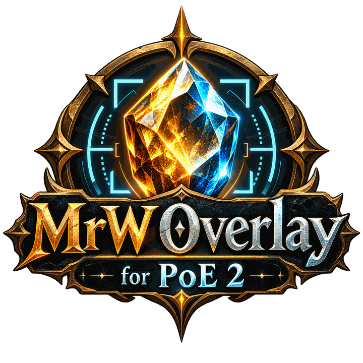</p>

<p align="center"><b>A loot filter that knows today's prices, and every tool you'd otherwise go hunting for, in one app.</b><br>
Price check, trade, live search, a crafting sim, Expedition prices. It sits quietly in the tray while you map.</p>

<p align="center">
  <a href="https://apps.microsoft.com/detail/9PM376D3LFBG"></a>
  <a href="https://buymeacoffee.com/mrworth"></a>
</p>
<p align="center">
  <a href="../../releases/latest"></a>
  <a href="https://chromewebstore.google.com/detail/ibjjhhjnfdokcbfckecbpkpibpdclpmn"></a>
  <a href="https://microsoftedge.microsoft.com/addons/detail/djfodaadmhknalfdphcadiojbfabedlc"></a>
  <a href="https://addons.mozilla.org/firefox/addon/mrw-overlay-for-poe-2-bridge/"></a>
  <a href="https://discord.gg/835k5r4k8k"></a>
  
  
</p>

<p align="center"><a href="README.tr.md">Türkçe</a> · <a href="https://poe2.mrwproject.com">Website</a></p>

<p align="center">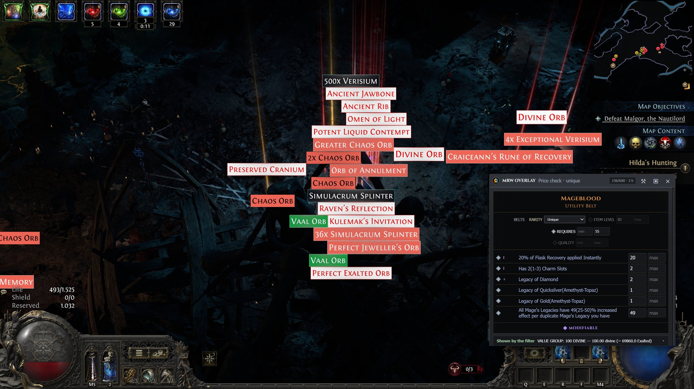</p>

## Why MrW Overlay?

- **One app instead of five.** Loot filter, price check, trade and live search, crafting sim, Expedition prices, game hotkeys. No more alt-tabbing between a dozen tools and websites.
- **Your filter follows the market.** You set a value, say 50 ex. Drops worth more get a strong highlight, cheap ones get hidden or dimmed. As prices move, the filter keeps up, and you never edit a list by hand mid-league.
- **Plays in your game's language.** English, Deutsch, Français, Español, Português, Русский, 日本語, 한국어 or 繁體中文: the price check, trade and Expedition prices read items the way your game writes them, show them in that language, and bring listings back in it. Every language the game offers works except Thai, which is not supported.
- **Approved everywhere it ships.** Microsoft Store, Chrome Web Store, Edge Add-ons and Firefox Add-ons have all reviewed and approved it.
- **Free.** No paywall, no "premium" features. Everyone gets the same app.

## Features

### Live-price loot filter
Built on top of [NeverSink's filter](https://github.com/NeverSinkDev/NeverSink-Filter-for-PoE2): all of NeverSink's work stays, and your price rules go on top. Uniques are priced from poe.ninja, currency and stackables from poe2scout, and exceptional bases (extra sockets, 21%+ quality) from the official trade site. MrW Overlay's own servers scan those bases around the clock, so you get the prices ready-made. The filter updates itself every 4 hours by default.

<p align="center">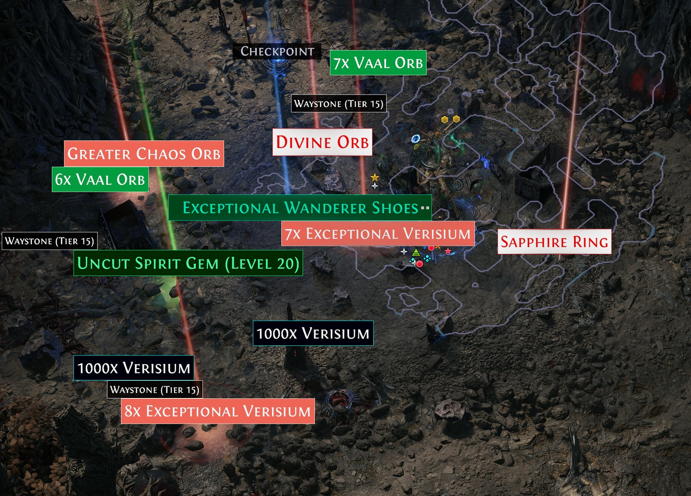</p>

### Your own groups, colours and sounds
Make up to 12 groups: lists of items to always show or hide, or value tiers with their own threshold in ex, chaos or div. Each group gets its own colour, beam, minimap icon and sound. You can pick from the app's ready-made styles, NeverSink's 68, or your own. All 26 in-game alert sounds can be previewed before you pick one.

<p align="center">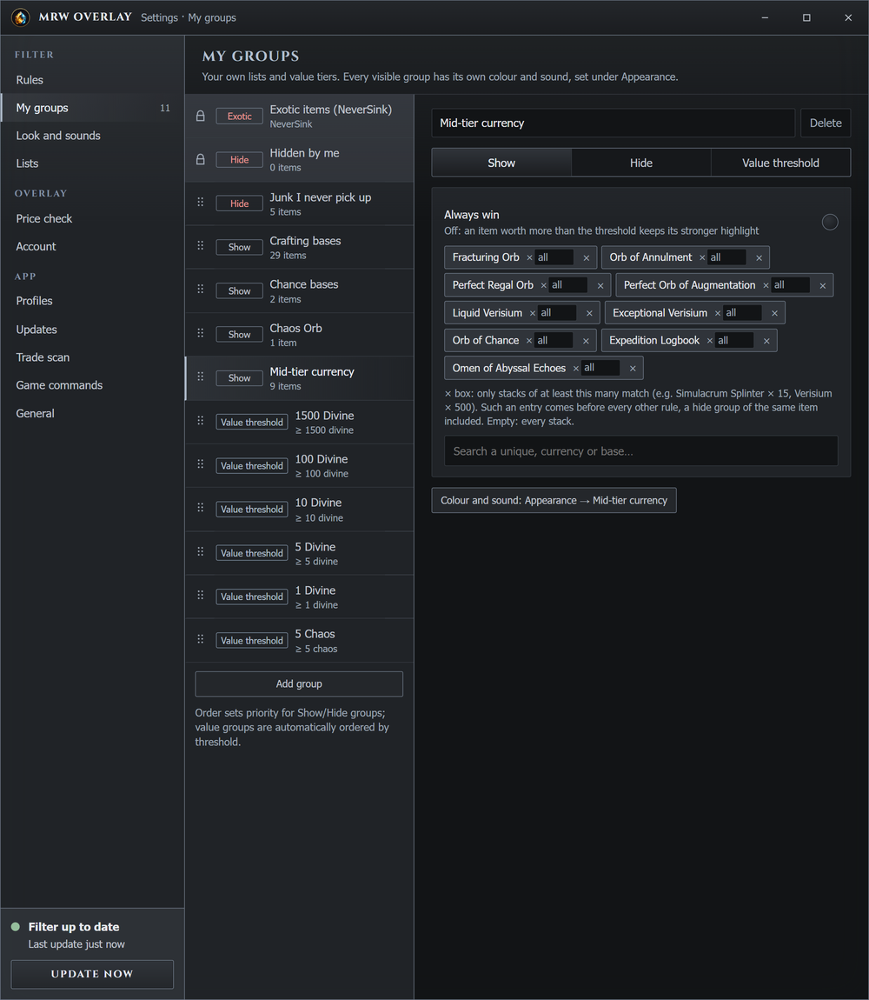 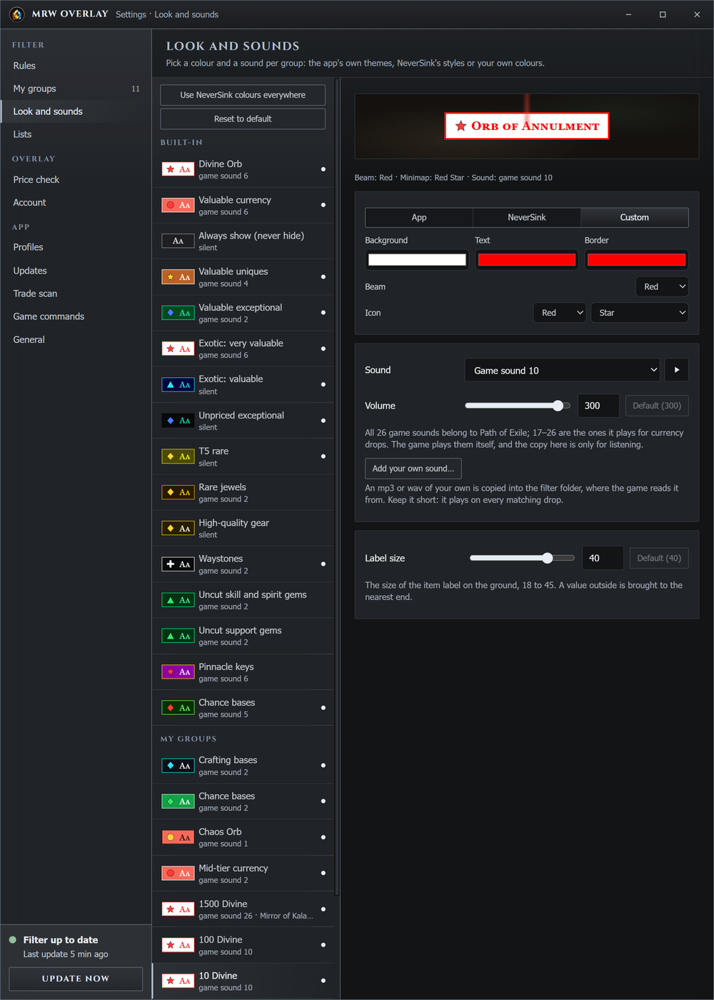</p>

### Price check, Alt+E
Hover an item in game and press Alt+E. A small window reads the item, lets you toggle affixes, DPS and properties in or out, and searches the official trade site. It can also read skill gems from the Skills panel and Expedition rewards straight off your screen.

<p align="center">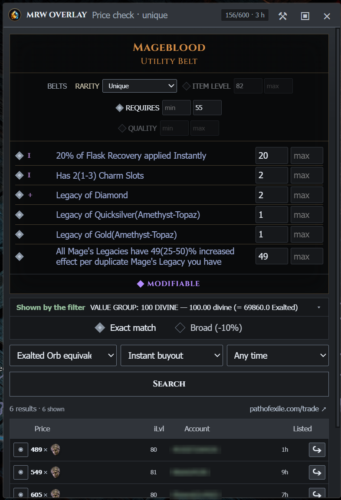 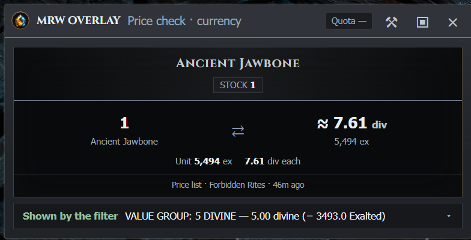</p>

**What is your filter doing with this?** The same window tells you whether your loot filter shows or hides the item, and which rule decided it. Don't want to see it again? **Alt+H** hides it from the filter, either for good or only while it's cheap. Everything you hide lands in "Hidden by me", where you can undo it.

<p align="center">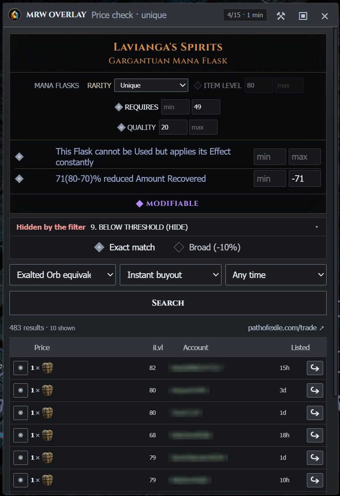 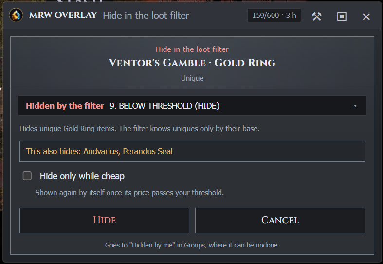</p>

### Trade and live search, Alt+M
The full trade search in a window over the game: every search in its own tab, saved searches in folders, one-click "search with this item's mods", and a button that takes you to the seller's hideout for instant-buyout listings. Live searches ping you with a sound and a notification while you keep playing.

<p align="center">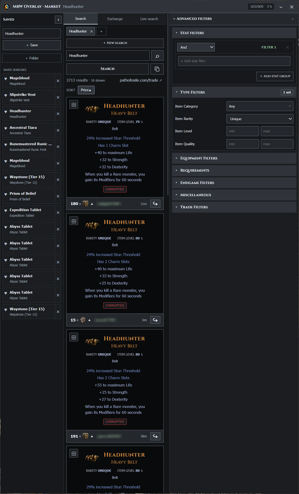 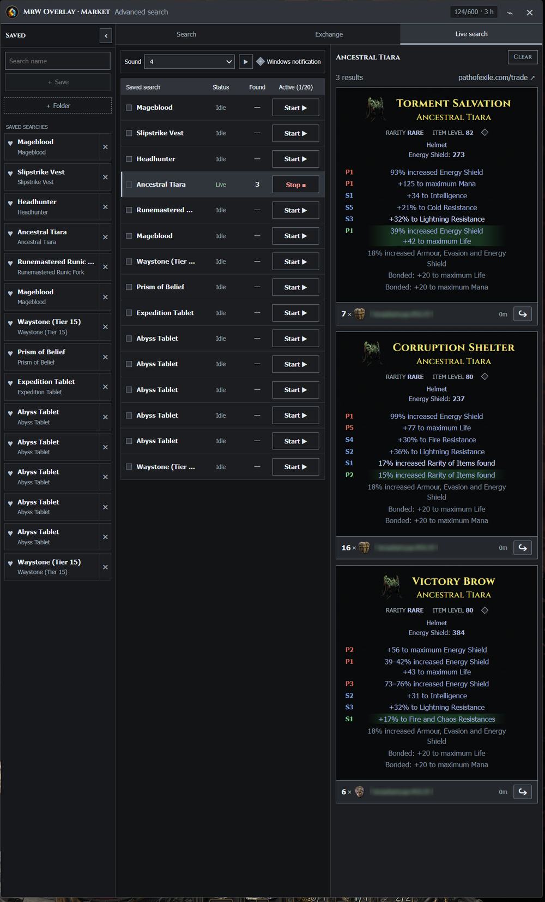</p>

### Theoretical Craft, Alt+F
A crafting sim built to behave like the game's own crafting: real bases, real mod weights and tiers, orbs, omens, essences, Desecrate, Fracturing, catalysts, Vaal and Sanctify, jewels, alloys and liquids. Pick up an orb and click the item, just like in game. The window shows the odds of each mod before you click, tracks what the craft has cost you at today's prices, and price-checks the result. Copy an item in game and send it to the craft window to plan your next step.

<p align="center">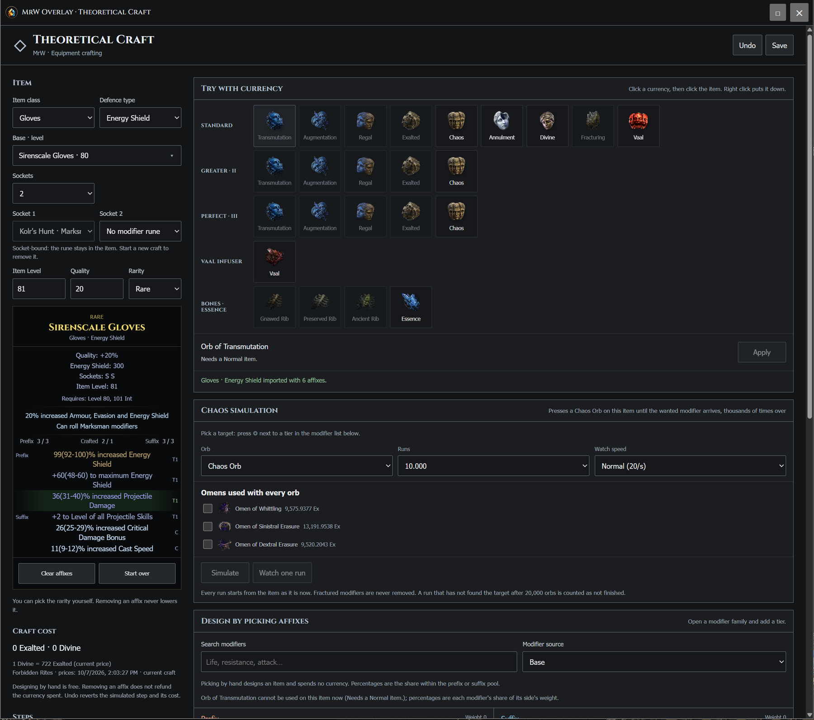</p>

### Expedition prices, Alt+Q
Open the Runeshape Combinations panel and press Alt+Q. Every reward gets a price label, coloured by your value groups. One key press is one read: the app never watches your screen.

<p align="center">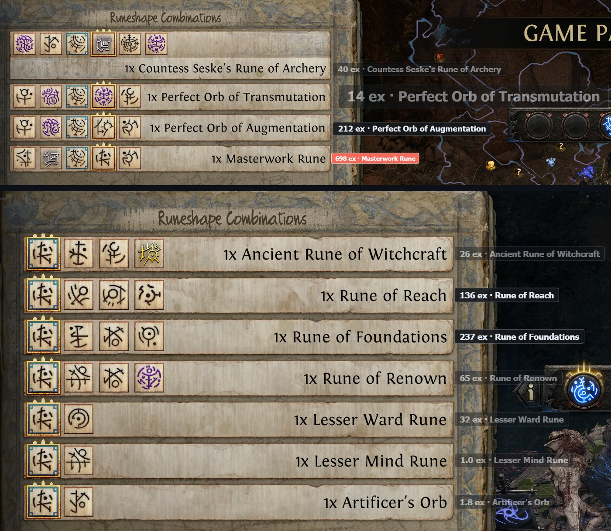</p>

### Public filter profiles
Keep separate setups for league start, Expedition farming or a strict endgame filter, and switch with one click. Publish a profile so other players can follow it, or browse what others shared, most followed first. A profile you follow updates itself when its author changes it.

<p align="center">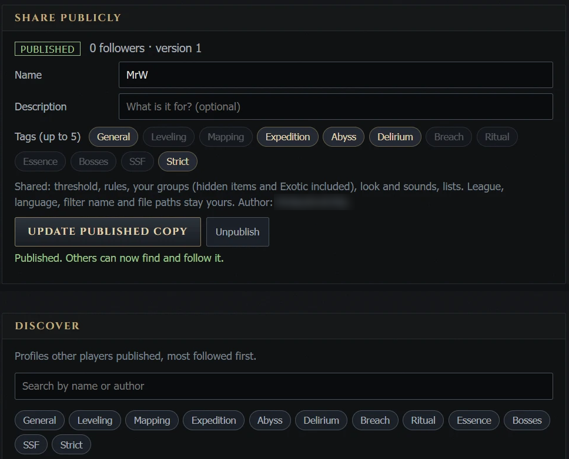</p>

### Themes
The app's own look is up to you: pick MrW Default, Dark or Light, or copy one and make it yours. Your theme is separate from your loot filter colours.

<p align="center">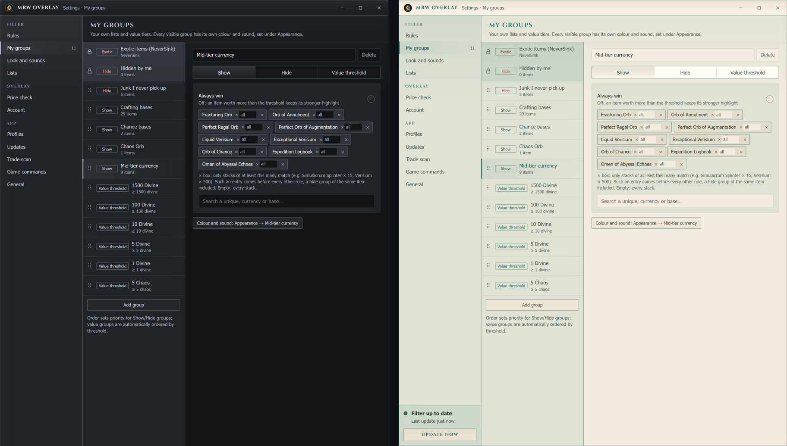</p>

### And the small things
- **Game hotkeys:** F5 /hideout, F6 /dnd, F7 invites your last whisperer, F8 sends a canned reply. All editable.
- **App in three languages, game in nine:** the app itself speaks English, Türkçe and 繁體中文. The price check, trade and Expedition labels follow your game instead: English, German, French, Spanish, Portuguese, Russian, Japanese, Korean or Traditional Chinese. Item names inside the loot filter stay in English, because that is what the game's filter matches in every language.
- **Profiles as files:** export a profile and hand it to a friend, or export just the finished filter.

## Built to do it right

A feature doesn't ship until it really works in game and plays by the rules.

- **No memory reading, no input automation.** The app never touches the game's memory and never presses keys for you. One hotkey is one action.
- **Gentle with the trade site.** Every request follows the rate limits the trade site announces. Exceptional bases are scanned on MrW Overlay's own servers, so your trade quota stays yours.
- **Screen reading only when you ask.** Expedition and gem reading capture the screen once per key press and read it on your PC with Windows' built-in OCR, in your game's language. Nothing is uploaded.
- **Your session stays on your PC.** If you connect your pathofexile.com account, the session is encrypted with Windows DPAPI and only ever sent to pathofexile.com.
- **Weak data never hides loot.** A unique with a single listing, or an exceptional with only a few, is never a reason to hide it.
- **Built in the open.** Every GitHub release exe is built from this repository by [GitHub Actions](.github/workflows/release.yml), never on a developer's machine, so what you download is the code you can read here.
- **Safe updates.** The GitHub build checks every update against its SHA-256 and rolls back if the new version won't start. The Store build is updated by the Store.
- **Light in the tray.** Measured idle: about 0.2% of one CPU core.
- **Tested by real players, all the time.** A group of active players uses the app every day and tries each new feature in their own maps.
- **Automated tests.** Around 290 of them cover the filter rules, the trade client, the item parser and the crafting engine, and every release passes them.
- **Keeps up on its own.** Prices and NeverSink's filter refresh by themselves, with no app update needed. App updates follow the game's patches.

## Install

- **Microsoft Store (recommended):** [MrW Overlay for POE 2](https://apps.microsoft.com/detail/9PM376D3LFBG). Installs and updates like any Store app, no SmartScreen warning.
- **GitHub:** grab `poe2filtre-windows-amd64.exe` from [Releases](../../releases/latest). It is a single file with no installer. The exe is not code-signed, so SmartScreen may say "Windows protected your PC": click **More info → Run anyway**. The SHA-256 is in the release notes.

Then:

1. Find the app in the system tray. Click the icon for the panel, right-click for the menu.
2. In game: **Options → Item Filter → auto_updated**.
3. After each update press **Reload** next to the filter. The game doesn't reload filters on its own.

Windows 10/11 with WebView2 (built into Windows 11). Settings live in `%APPDATA%\PoE2Filtre`, shared by both builds.

### Uninstall

- **Microsoft Store:** Windows Settings → Apps → Installed apps → MrW Overlay for POE 2 → Uninstall.
- **GitHub exe:** if you turned on **Run at Windows startup**, turn it off in the app's settings first. Then right-click the tray icon → **Quit** and delete the exe.

To remove your settings too, delete `%APPDATA%\PoE2Filtre`. The generated filter is `auto_updated.filter` in `Documents\My Games\Path of Exile 2`; delete it if you no longer want it in game.

### Browser extension (optional)
For live search, hideout travel and bigger searches, the app needs your pathofexile.com session. A small extension hands it over: [Chrome](https://chromewebstore.google.com/detail/ibjjhhjnfdokcbfckecbpkpibpdclpmn) · [Edge](https://microsoftedge.microsoft.com/addons/detail/djfodaadmhknalfdphcadiojbfabedlc) · [Firefox](https://addons.mozilla.org/firefox/addon/mrw-overlay-for-poe-2-bridge/). It only acts when you press **Settings → Account → Connect browser**. It reads the session cookie and your account name and passes them to the app on your own PC (`127.0.0.1`). It never asks for your password and never changes the page. Source: [`browser-extension/`](browser-extension/).

## FAQ

**The filter doesn't change in game.** Update in the app, then Options → Item Filter → **Reload** in game. No restart needed.

**Can this get me banned?** The app reads no game memory and sends no input. It writes a text file, copies an item with the game's own copy command when you press the hotkey, and talks to the public trade API within its limits.

**Too much / too little is hidden.** Change the value threshold first, then NeverSink's strictness. The strictness sets the base and the threshold sets your rules.

**I always want to see one item.** Add it to "Always show", or make your own group. For only its unique version, write `Base name|unique`.

**Why does a cheap unique still get the big highlight?** Uniques drop unidentified, and a loot filter can only see their base (Sapphire Ring, Heavy Belt…), not which unique it is. So the app looks at every unique that can drop on that base and goes by the most valuable one. Say three Sapphire Ring uniques are cheap and one is worth a lot: every unique Sapphire Ring gets highlighted, because the one on the ground might be the expensive one. Identify it to see which one you got. If that base isn't worth stopping for, **Alt+H** hides its uniques, for good or only while they stay cheap. A price backed by a single listing is never a reason to hide a base.

**I want different setups for different content.** Settings → Profiles: save, switch, export, or follow a public profile.

**My game isn't in English.** Nothing to set: the app sees the language in what you copy and in the game's settings. For Skills panel gems and Expedition rewards, Windows needs the OCR for that language (Windows Settings → Time & language → Language & region → add the language). Without it, Windows reads with your display language, which works for Latin letters but not for Russian, Japanese, Korean or Chinese.

**What if a price source goes down?** The last known prices are kept and the filter is still written.

**I want to start over.** Quit the app and delete `%APPDATA%\PoE2Filtre`.

## Support the project

MrW Overlay is free and will stay free. It takes a lot of evenings to keep it in line with every patch and league. If it saves you time, you can [buy me a coffee](https://buymeacoffee.com/mrworth) (no account needed, card, Apple Pay or Google Pay), sponsor it monthly on [GitHub Sponsors](https://github.com/sponsors/kadircelebi), or just leave a ⭐ on this page. Support unlocks nothing in the app; everyone gets every feature.

<p><a href="https://buymeacoffee.com/mrworth"></a> <a href="https://github.com/sponsors/kadircelebi"></a></p>

Found a bug or have an idea? [Open an issue](../../issues/new/choose), or come say hi on [Discord](https://discord.gg/835k5r4k8k).

## Privacy

The app has no telemetry or analytics, and it never sends your session cookie or account name to MrW Overlay's servers.

It reads public data: prices from [poe.ninja](https://poe.ninja/) and [poe2scout](https://poe2scout.com/), listings from the official trade API (from its edition in your game's language, such as de.pathofexile.com, when you play in another language), and NeverSink's filter from GitHub.

- **Browser extension:** if you connect it, it sends your session and account name only to the app on the same PC. They are stored with Windows DPAPI, the session is sent only to `www.pathofexile.com` for trade actions you ask for, and **Settings → Account → Disconnect** deletes both.
- **Public profiles:** these are optional. Only publishing or following talks to the MrW Overlay profile server (`profiles.mrwproject.com`). Publishing makes the profile's filter settings, its name, description and tags, and your account name (as the author) public. League, language, file paths, sound files, your session and price settings are never sent. Following stores a hash of a random install key, plus a salted hash of the IP (not the IP itself) to limit abuse. Unpublishing deletes the profile and its followers.
- **Price check:** this is off by default. When you press the hotkey, the app copies that item's text with the game's copy command and sends a search to the official trade API.

Full policy: [poe2.mrwproject.com](https://poe2.mrwproject.com/privacy/).

## Code signing policy

The GitHub release exe is built from this repository by GitHub Actions ([release workflow](.github/workflows/release.yml)). No release binary is built or uploaded by hand, and every release is approved before it is published.

- Committers and reviewers: [kadircelebi](https://github.com/kadircelebi)
- Approvers: [kadircelebi](https://github.com/kadircelebi)

Pull requests from other contributors are reviewed before they are merged. Privacy: see [Privacy](#privacy) above and the [full privacy policy](https://poe2.mrwproject.com/privacy/).

## For developers

The code is here so you can see exactly what the app does. To build it yourself, download the repository (**Code → Download ZIP**) and double-click **`build.bat`**. It checks for [Go](https://go.dev/dl/) 1.25+ and [Node.js](https://nodejs.org/) 20+, installs the Wails CLI if needed and produces `bin\poe2filter.exe`. Windows Smart App Control blocks unsigned exes you build yourself; use the release exe if you'd rather keep it on.

```
wails3 build      # bin/poe2filter.exe
go test ./...     # Go tests
cd frontend && npm run check   # types, translations, encoding
```

To add a language to the app, copy `frontend/src/lib/locales/en.ts` and `internal/i18n/en.go` and translate them; the checks report missing keys. The game-language tables in `internal/overlay/data/locale/` are rebuilt with `python build/locale/build_locale.py <lang>`; copied items from each language are tested in `internal/overlay/testdata/locale/`.

## License

MIT, see [LICENSE](LICENSE). Exceptions are listed in [NOTICE](NOTICE). The 26 alert sounds in `internal/gamesounds/files/` belong to Grinding Gear Games. The crafting data from poe2db.tw is under CC BY-NC-SA 3.0. NeverSink's filter is MIT licensed too, and the app downloads it at runtime. The game-language tables are built from [Exiled Exchange 2](https://github.com/Kvan7/Exiled-Exchange-2)'s data (MIT).

MrW Overlay is built by a player, for players. It is not an official Grinding Gear Games product, and they don't back it. Path of Exile 2 and everything in it belong to them.
